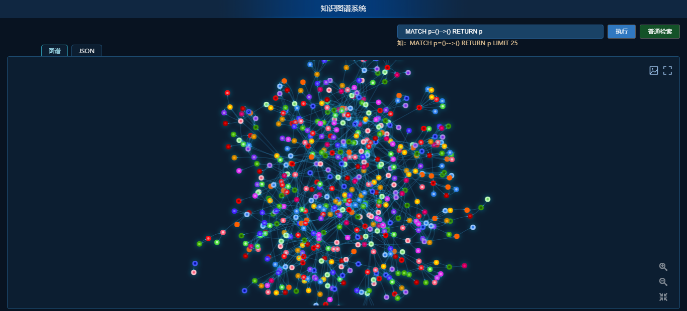

[English](README.md) | 简体中文

 

    
    
    
    

## Open-KG——开源知识图谱简介
Open-KG源自于东华大学智能制造研究所，旨在打造一套丰富、领先、且实用的知识图谱构建系统，助力开发者快速构建知识图谱，并应用落地。

### 系统未完成-[demo](http://124.221.220.105:8088/neo4j/#/)

    

## 近期更新

- **🔥冶金领域设备运维大规模知识图谱在OpenKG.CN中文开放知识图谱即将开源**
